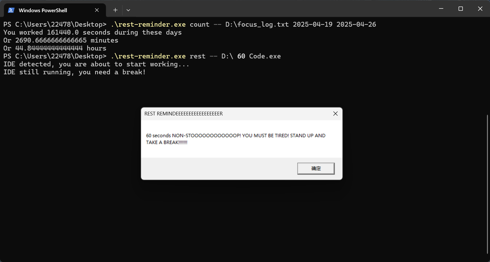
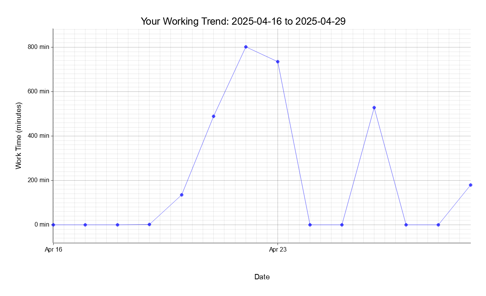

# 休息提醒工具（支持 Windows 和 macOS）


这是一个基于 Rust 的跨平台应用程序，支持 Windows 和 macOS 系统，用于监控指定软件是否正在运行，并在连续使用指定时间后提醒你休息。
它还会记录你的专注工作时长到文件中，且可以计算指定时间区间的工作时长并生成走势图。

## 功能特点

- 监控特定进程（Windows: `idea64.exe`、`rustrover64.exe`；macOS: `IntelliJ IDEA`、`RustRover`、`Code`、`Xcode`）
- 跟踪专注工作时长
- 在连续工作指定时间后显示系统原生弹窗提醒休息（Windows 使用 MessageBox，macOS 使用 NSAlert）
- 展示你的工作时间走势
- 跨平台支持（Windows 和 macOS）

## 工作示例

### Windows
> 
> 

### macOS
> 
> 

#### 示例 `focus_log.txt`: [`focus_log.txt`](focus_log.txt)

## 工作原理

1. 程序检查是否正在运行指定程序。
2. 如果检测到指定程序，它会开始计时。
3. 如果指定时间过去，而程序仍未关闭，程序将弹出一个系统提示框提醒你休息。
4. 工作会话记录到文件中以供存档。
5. 使用`count`族命令来获取指定时间段的工作时长。
6. 使用`plot`命令来获取你的工作时长走势

## 平台支持

### Windows
- 默认日志存储位置：`D:\focus_log.txt`
- 默认监控应用：`idea64.exe`、`rustrover64.exe`
- 使用系统 MessageBox 显示提醒

### macOS  
- 默认日志存储位置：`~/focus_log.txt`
- 默认监控应用：`IntelliJ IDEA`、`RustRover`、`Code`、`Xcode`
- 使用原生 NSAlert 显示提醒

## 使用方法
直接运行Rest Reminder，可以看到如下交互界面：
```aiignore
Welcome to Rest Reminder Interactive Mode
═══════════════════════════════════════════════
Available commands:
  rest              - Start monitoring and remind you to rest
  count             - Count work time between two days
  count-single-day  - Count work time for a specific day
  count-precise     - Count work time between precise timestamps
  plot              - Generate work time trend plot
  help              - Show this help message
  exit              - Exit the program
═══════════════════════════════════════════════
Type a command and press Enter. Example: rest -t 3600 -a Cursor -l ~/Desktop/focus_log.txt

RestReminder> 
```
输入命令后，Rest Reminder会自动开始工作。

### 1. 工作检测
**Windows:**
```bash
rest -l <PATH> -t <TIME> -a <PROCESS_1> <PROCESS_2> ...
```

**macOS:**
```bash
rest -l <PATH> -t <TIME> -a <PROCESS_1> <PROCESS_2> ...
```

* 若未指定`focus_log.txt`的文件存放位置，程序会自动使用平台默认地址（Windows: `D:\`，macOS: `~/`）
* `<TIME>`需要以**秒**为单位填写（不能用分钟或小时）。默认值为3600秒（1小时）
* 可列出所有你希望Rest Reminder监控的进程。默认监控的应用程序因平台而异（见上方平台支持章节）

**Windows 示例:**
```bash
rest -l D:\ -t 3600 -a Notion.exe Code.exe
```
* 指定`D:\`时，`focus_log.txt`会保存在`D:\`目录下
* 指定`3600`时，Rest Reminder会每隔1小时提醒你休息
* 指定`Notion.exe`和`Code.exe`时，Rest Reminder会监控**Notion**和**VS Code**两个程序是否正在运行

**macOS 示例:**
```bash
rest -l ~/ -t 3600 -a "Notion" "Visual Studio Code"
```
* 指定`~/`时，`focus_log.txt`会保存在用户主目录下
* 指定`3600`时，Rest Reminder会每隔1小时提醒你休息
* 指定`Notion`和`Visual Studio Code`时，Rest Reminder会监控**Notion**和**VS Code**两个程序是否正在运行

> **注意：不要在目录后加上`focus_log.txt`！** 例如：
> * `D:\`: 允许
> * `D:\focus_log.txt`: **不被允许**
> * `D:\name`: **不被允许**，因为地址最后没有加上 `\`

### 2. 累计工作时间统计
Rest Reminder提供三种统计方式：
1. `count`
2. `count-single-day`
3. `count-precise`

#### 2.1. 按天区间统计
如果想统计某个日期区间的总工作时长：

**Windows:**
```bash
count -- -l <PATH> -s <START> -e <END>
```

**macOS:**
```bash
count -- -l <PATH> -s <START> -e <END>
```

* `<PATH>`：填写`focus_log.txt`的完整路径（包括文件名）
* `<START>`、`<END>`：按`YYYY-MM-DD`格式指定起止日期

**Windows 示例:**
```bash
count -- -l D:\focus_log.txt -s 2025-04-19 -e 2025-04-27
```

**macOS 示例:**
```bash
count -- -l ~/focus_log.txt -s 2025-04-19 -e 2025-04-27
```
Rest Reminder 会自动计算从 2025-04-19 到 2025-04-27 期间的总工作时长。
> **提示**：别忘了在`<PATH>`后面加上文件名（Windows: `\focus_log.txt`，macOS: `/focus_log.txt`）！

#### 2.2. 查询单日工作时长
要统计某一天的工作时长，运行：

**Windows:**
```bash
count-single-day -- -l <PATH> -d <DAY>
```

**macOS:**
```bash
count-single-day -- -l <PATH> -d <DAY>
```

* `<PATH>`：同上，`focus_log.txt`的完整路径
* `<DAY>`：按`YYYY-MM-DD`格式指定日期

**Windows 示例:**
```bash
count-single-day -- -l D:\focus_log.txt -d 2025-04-26
```

**macOS 示例:**
```bash
count-single-day -- -l ~/focus_log.txt -d 2025-04-26
```
该命令会输出2025-04-26当天的工作总时长。

#### 2.3. 精确时间段统计
如果想统计某个具体时间段的工作时长，运行：

**Windows:**
```bash
count-precise -- -l <PATH> -s <START> -e <END>
```

**macOS:**
```bash
count-precise -- -l <PATH> -s <START> -e <END>
```

* `<START>`、`<END>`：按`YYYY-MM-DD HH-MM-SS`格式指定，并**用双引号括起来**

**Windows 示例:**
```bash
count-precise -- -l D:\focus_log.txt -s "2025-04-19 22:50:00" -e "2025-04-26 13:45:30"
```

**macOS 示例:**
```bash
count-precise -- -l ~/focus_log.txt -s "2025-04-19 22:50:00" -e "2025-04-26 13:45:30"
```

该命令会输出从 2025-04-19 22:50:00 到 2025-04-26 13:45:30 这段时间内的工作时长。

### 3. 工作时长走势图
你同样可以洞悉你的工作时长走势！执行以下命令：

**Windows:**
```bash
plot -- -l <LOG_PATH> -p <PLOT_PATH> -s <START> -e <END>
```

**macOS:**
```bash
plot -- -l <LOG_PATH> -p <PLOT_PATH> -s <START> -e <END>
```

* `<LOG-PATH>`: `focus_log.txt`文件地址
* `<PLOT-PATH>`: 你希望存储走势图的位置
* `<START>` & `<END>`: 格式为`YYYY-MM-DD`

**Windows 示例:**
```bash
plot -- -l D:\focus_log.txt -p D:\plot.png -s 2025-04-16 -e 2025-04-29
```

**macOS 示例:**
```bash
plot -- -l ~/focus_log.txt -p ~/plot.png -s 2025-04-16 -e 2025-04-29
```
Rest Reminder将生成2025-04-16到2025-04-29期间的工作时间走势图，并将 `plot.png`图片存储到指定位置。
> **注意**: 必须对图片命名！

## 旧使用方法（已过时）

### 1. 工作检测
如果你不打算更改任何东西，建议直接从 Releases 页面下载。在下载后，运行以下命令：

**Windows:**
```bash
rest-reminder.exe rest -l <PATH> -t <TIME> -a <PROCESS_1> <PROCESS_2> ...
```

**macOS:**
```bash
./rest-reminder rest -l <PATH> -t <TIME> -a <PROCESS_1> <PROCESS_2> ...
```

* 若未指定`focus_log.txt`的文件存放位置，程序会自动使用平台默认地址（Windows: `D:\`，macOS: `~/`）
* `<TIME>`需要以**秒**为单位填写（不能用分钟或小时）。默认值为3600秒（1小时）  
* 可列出所有你希望Rest Reminder监控的进程。默认监控的应用程序因平台而异（见上方平台支持章节）

**Windows 示例:**
```bash
rest-reminder.exe rest -l D:\ -t 3600 -a Notion.exe Code.exe
```
* 指定`D:\`时，`focus_log.txt`会保存在`D:\`目录下
* 指定`3600`时，Rest Reminder会每隔1小时提醒你休息
* 指定`Notion.exe`和`Code.exe`时，Rest Reminder会监控**Notion**和**VS Code**两个程序是否正在运行

**macOS 示例:**
```bash
./rest-reminder rest -l ~/ -t 3600 -a "Notion" "Visual Studio Code"
```
* 指定`~/`时，`focus_log.txt`会保存在用户主目录下
* 指定`3600`时，Rest Reminder会每隔1小时提醒你休息
* 指定`Notion`和`Visual Studio Code`时，Rest Reminder会监控**Notion**和**VS Code**两个程序是否正在运行

> **注意：不要在目录后加上`focus_log.txt`！** 例如：
> * `D:\`: 允许
> * `D:\focus_log.txt`: **不被允许**
> * `D:\name`: **不被允许**，因为地址最后没有加上 `\`

### 2. 累计工作时间统计
Rest Reminder提供三种统计方式：
1. `count`
2. `count-single-day`
3. `count-precise`

#### 2.1. 按天区间统计
如果想统计某个日期区间的总工作时长：

**Windows:**
```bash
rest-reminder.exe count -- -l <PATH> -s <START> -e <END>
```

**macOS:**
```bash
./rest-reminder count -- -l <PATH> -s <START> -e <END>
```

* `<PATH>`：填写`focus_log.txt`的完整路径（包括文件名）
* `<START>`、`<END>`：按`YYYY-MM-DD`格式指定起止日期

**Windows 示例:**
```bash
rest-reminder.exe count -- -l D:\focus_log.txt -s 2025-04-19 -e 2025-04-27
```

**macOS 示例:**
```bash
./rest-reminder count -- -l ~/focus_log.txt -s 2025-04-19 -e 2025-04-27
```
Rest Reminder 会自动计算从 2025-04-19 到 2025-04-27 期间的总工作时长。
> **提示**：别忘了在`<PATH>`后面加上文件名（Windows: `\focus_log.txt`，macOS: `/focus_log.txt`）！

#### 2.2. 查询单日工作时长
要统计某一天的工作时长，运行：

**Windows:**
```bash
rest-reminder.exe count-single-day -- -l <PATH> -d <DAY>
```

**macOS:**
```bash
./rest-reminder count-single-day -- -l <PATH> -d <DAY>
```

* `<PATH>`：同上，`focus_log.txt`的完整路径
* `<DAY>`：按`YYYY-MM-DD`格式指定日期

**Windows 示例:**
```bash
rest-reminder.exe count-single-day -- -l D:\focus_log.txt -d 2025-04-26
```

**macOS 示例:**
```bash
./rest-reminder count-single-day -- -l ~/focus_log.txt -d 2025-04-26
```
该命令会输出2025-04-26当天的工作总时长。

#### 2.3. 精确时间段统计
如果想统计某个具体时间段的工作时长，运行：

**Windows:**
```bash
rest-reminder.exe count-precise -- -l <PATH> -s <START> -e <END>
```

**macOS:**
```bash
./rest-reminder count-precise -- -l <PATH> -s <START> -e <END>
```

* `<START>`、`<END>`：按`YYYY-MM-DD HH-MM-SS`格式指定，并**用双引号括起来**

**Windows 示例:**
```bash
rest-reminder.exe count-precise -- -l D:\focus_log.txt -s "2025-04-19 22:50:00" -e "2025-04-26 13:45:30"
```

**macOS 示例:**
```bash
./rest-reminder count-precise -- -l ~/focus_log.txt -s "2025-04-19 22:50:00" -e "2025-04-26 13:45:30"
```

该命令会输出从 2025-04-19 22:50:00 到 2025-04-26 13:45:30 这段时间内的工作时长。

### 3. 工作时长走势图
你同样可以洞悉你的工作时长走势！执行以下命令：

**Windows:**
```bash
rest-reminder.exe plot -- -l <LOG_PATH> -p <PLOT_PATH> -s <START> -e <END>
```

**macOS:**
```bash
./rest-reminder plot -- -l <LOG_PATH> -p <PLOT_PATH> -s <START> -e <END>
```

* `<LOG-PATH>`: `focus_log.txt`文件地址
* `<PLOT-PATH>`: 你希望存储走势图的位置
* `<START>` & `<END>`: 格式为`YYYY-MM-DD`

**Windows 示例:**
```bash
rest-reminder.exe plot -- -l D:\focus_log.txt -p D:\plot.png -s 2025-04-16 -e 2025-04-29
```

**macOS 示例:**
```bash
./rest-reminder plot -- -l ~/focus_log.txt -p ~/plot.png -s 2025-04-16 -e 2025-04-29
```
Rest Reminder将生成2025-04-16到2025-04-29期间的工作时间走势图，并将 `plot.png`图片存储到指定位置。
> **注意**: 必须对图片命名！

## 编译与构建
本节适用于希望自己编写Python脚本插件的用户。

### 1. 前置要求
- Rust 工具链（推荐最新稳定版）
- Python 3.12 及以下（截至25/08/2025）

### 2. 编译

```bash
# 克隆项目
git clone <repository-url>
cd rest-reminder

# 编译项目
cargo build --release

[# 如果使用比3.12更高的版本，则需要在cargo前限定python版本，否则会报错]
[PYO3_USE_ABI3_FORWARD_COMPATIBILITY=1 cargo build --release]
```

编译成功后，可执行文件位于 `target/release/` 目录中。

### 3. 测试
需运行`/tests`下的所有单元测试和两个shell脚本测试以确保代码能够顺利运行。

```bash
cargo test

[# 同理]
[PYO3_USE_ABI3_FORWARD_COMPATIBILITY=1 cargo test]

cd tests
./test_interactive.sh
./test_plugin.sh
```

### 4. 运行
编译与测试都通过后，可以尝试运行。
```bash
cargo run -- rest --help

[# 同理]
[PYO3_USE_ABI3_FORWARD_COMPATIBILITY=1 cargo run -- rest --help]
```

### 5. 编写脚本
脚本应当统一置于`/plugins`文件夹中。该文件夹中已有一个示例Python脚本：`hello_world.py`。

一共有3个钩子：`on_init`、`on_work_start`和`on_break_reminder`，分别在Rest Reminder初始化、工作开始和休息开始的时候被触发。自定义的脚本应当至少包含这3个钩子的其中一个。

```aiignore
RestReminder> rest -t 3 -a idea -l focus_log.txt
Starting Rest Reminder...
Loading plugins from: plugins # 开始加载钩子
Hello World plugin loaded!
  ✓ Loaded plugin: hello_world
Loaded 1 plugin(s) successfully
Triggering hook: on_init for 1 plugin(s) # 初始化钩子
Hello World! Rest Reminder has been initialized!
Message: Rest Reminder initialized
Timestamp: 2025-08-25 22:02:41
Hello World plugin is ready!
  ✓ hello_world executed on_init
Process(es) detected, you are about to start working...
Triggering hook: on_work_start for 1 plugin(s) # 工作钩子
Hello! You're starting to work!
Message: Work session started
Time: 2025-08-25 22:02:41
Good luck with your work session!
  ✓ hello_world executed on_work_start
Process(es) still running, you need a break!
Triggering hook: on_break_reminder for 1 plugin(s) # 休息钩子
[Python Plugin] Hello! Time for a break!
[Python Plugin] Message: Time to take a break!
[Python Plugin] Work duration: 3 seconds
[Python Plugin] Remember to stretch and hydrate!
[Python Plugin] Short but productive session! Keep it up!
  ✓ hello_world executed on_break_reminder
button returned:OK
Logging to focus_log.txt
```