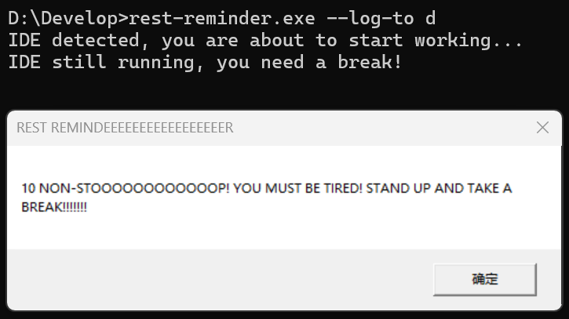

# 休息提醒工具（目前仅限 Windows 用户）

这是一个基于 Rust 的小型 Windows 应用程序，用于监控指定软件是否正在运行，并在连续使用指定时间后提醒你休息。
它还会记录你的专注工作时长到文件中，且可以计算指定时间区间的工作时长。

## 功能特点

- 监控特定进程（例如 `idea64.exe`、`rustrover64.exe`）
- 跟踪专注工作时长
- 在连续工作 1 小时后显示系统弹窗提醒休息

## 工作示例

> 

## 工作原理

1. 程序检查是否正在运行指定程序。
2. 如果检测到指定程序，它会开始计时。
3. 如果指定时间过去，而程序仍未关闭，程序将弹出一个系统提示框提醒你休息。
4. 工作会话记录到文件中以供存档。
5. 使用`count`族命令来获取指定时间段的工作时长。

## 使用方法
如上所述，有两种方法来使用Rest Reminder。

### 1. 工作检测
如果你不打算更改任何东西，建议直接从 Releases 页面下载。在下载后，运行以下命令：

```aiignore
rest-reminder.exe rest -- <PATH> <TIME> <PROCESS_1> <PROCESS_2> ...
```
* 若未指定`focus_log.txt`的文件存放位置，程序会自动指定`D:\`为默认地址
* `<TIME>`需要以**秒**为单位填写（不能用分钟或小时）。默认值为3600秒（1小时）
* 可列出所有你希望Rest Reminder监控的进程。默认监控的是IntelliJ IDEA的`idea64.exe`和RustRover的`rustrover64.exe`

例如：
```aiignore
rest-reminder.exe rest -- D:\ 3600 Notion.exe Code.exe
```
* 指定`D:\`时，`focus_log.txt`会保存在`D:\`目录下
* 指定`3600`时，Rest Reminder会每隔1小时提醒你休息
* 指定`Notion.exe`和`Code.exe`时，Rest Reminder会监控**Notion**和**VS Code**两个程序是否正在运行

> **注意：不要在目录后加上`focus_log.txt`！** 例如：
> * `D:\`: 允许
> * `D:\focus_log.txt`: **不被允许**
> * `D:\name`: **不被允许**，因为地址最后没有加上 `\`


### 2. 累计工作时间统计
Rest Reminder提供三种统计方式：
1. `count`
2. `count-single-day`
3. `count-precise`

#### 2.1. 按天区间统计
如果想统计某个日期区间的总工作时长：
```aiignore
rest-reminder.exe count -- <PATH> <START> <END>
```
* `<PATH>`：填写`focus_log.txt`的完整路径（包括文件名）
* `<START>`、`<END>`：按`YYYY-MM-DD`格式指定起止日期

示例：
```aiignore
rest-reminder.exe count -- D:\focus_log.txt 2025-04-19 2025-04-27
```
Rest Reminder 会自动计算从 2025-04-19 到 2025-04-27 期间的总工作时长。
> **提示**：别忘了在`<PATH>`后面加上`\focus_log.txt`！

#### 2.2. 查询单日工作时长
要统计某一天的工作时长，运行：
```aiignore
rest_reminder.exe count-single-day -- <PATH> <DAY>
```
* `<PATH>`：同上，`focus_log.txt`的完整路径
* `<DAY>`：按`YYYY-MM-DD`格式指定日期

示例：
```aiignore
rest-reminder.exe count-single-day -- D:\focus_log.txt 2025-04-26
```
该命令会输出2025-04-26当天的工作总时长。

#### 2.3. 精确时间段统计
如果想统计某个具体时间段的工作时长，运行：
```aiignore
rest-reminder.exe count-precise -- <PATH> <START> <END>
```
* `<START>`、`<END>`：按`YYYY-MM-DD HH-MM-SS`格式指定，并**用双引号括起来**

示例：
```aiignore
rest-reminder.exe count-precise -- D:\focus_log.txt "2025-04-19 22:50:00" "2025-04-26 13:45:30"
```
该命令会输出从 2025-04-19 22:50:00 到 2025-04-26 13:45:30 这段时间内的工作时长。