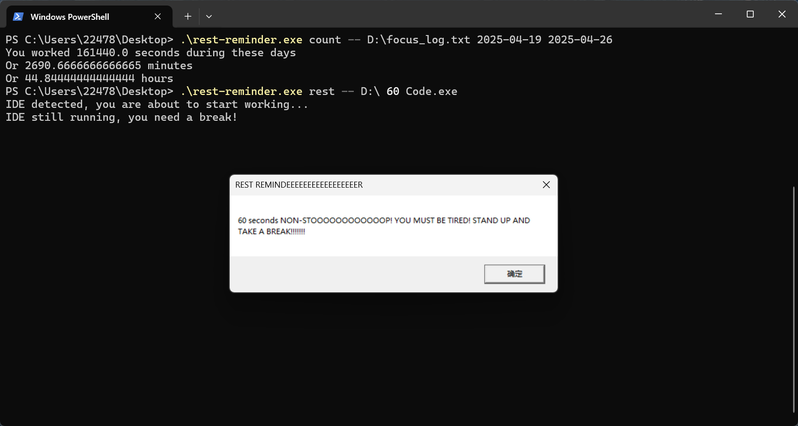
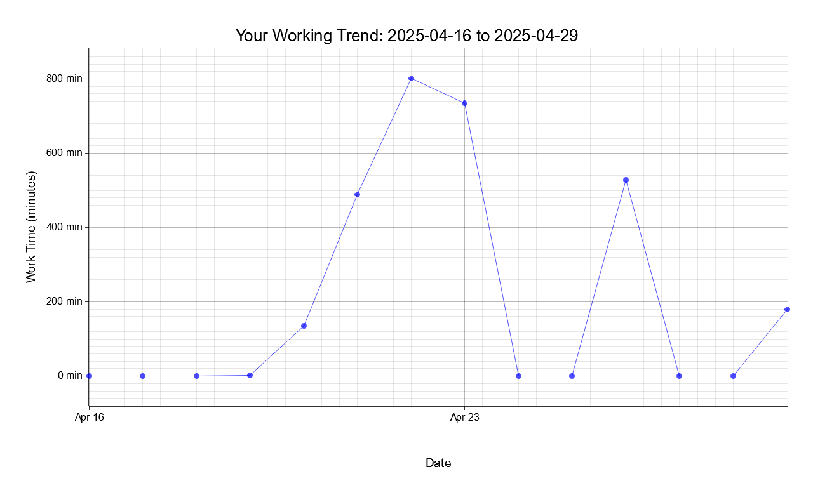
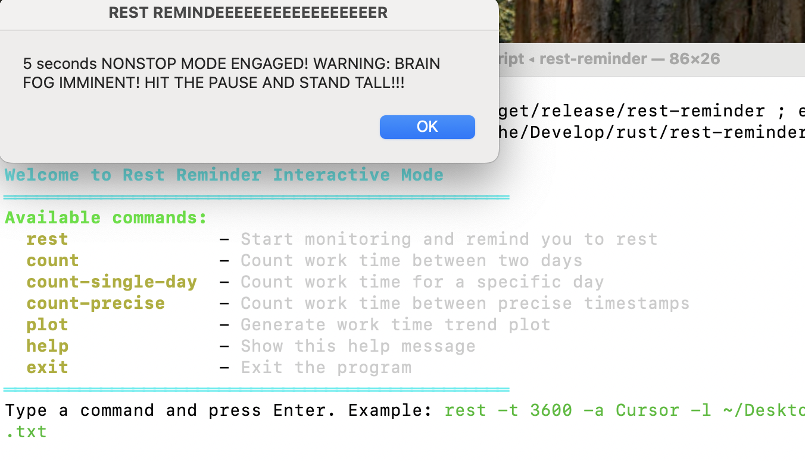

# 休息提醒工具


English: [README.md](./README.md)

Rest Reminder 是一个基于 Rust 的桌面工具，用于监控专注工作状态。它可以检测指定应用是否正在运行，在连续工作达到设定时间后提醒休息，把工作会话记录到 `focus_log.txt`，并支持统计工作时长与生成工作趋势图。

项目现在同时支持命令行工作流和本地 Web 界面。

## 功能特点

- 支持 Windows、macOS，以及 Linux 类环境的基础回退行为。
- 监控指定应用进程。
- 原生休息提醒：
  - Windows: MessageBox
  - macOS: AppleScript 弹窗
  - 其他平台：终端提醒输出
- 将工作会话写入 `focus_log.txt`。
- 支持按日期范围、单日、精确时间段统计工作时长。
- 支持生成 PNG 工作趋势图。
- 提供本地 Web UI：`http://localhost:60606`。
- Web UI 支持英文、简体中文、繁体中文、日语、法语。
- Web UI 支持原生文件/目录选择器，选择日志目录、日志文件和图表保存位置。
- Web UI 支持当前运行进程下拉选择，不需要用户手动查询进程名。
- Web UI 显示当前监控状态、已运行时间，并支持暂停、继续和停止监控。
- Web UI 会保存日志路径、提醒间隔和已选择的监控应用，下次打开自动恢复。
- Web UI 支持最近日志预览和生成图表后的页面内预览。
- Web UI 支持插件管理：查看插件、启用/禁用插件、生成模板、查看最近插件错误。
- 支持给工作会话添加任务标签，并在 CLI 和 Web UI 中按任务标签过滤统计。
- 支持 Python 插件，在程序初始化、工作开始、休息提醒时执行自定义逻辑。

## 截图

### Windows

> 
> 

### macOS

> 
> 

示例日志文件：[`focus_log.txt`](focus_log.txt)

## 工作原理

1. Rest Reminder 检查指定进程是否正在运行。
2. 如果检测到目标进程，开始记录一次工作会话。
3. 如果目标进程持续运行超过设定时长，弹出休息提醒。
4. 工作会话被追加写入 `focus_log.txt`。
5. 统计命令和 Web UI 从日志文件中计算工作时长。
6. 图表命令和 Web UI 可以根据日志生成工作趋势图。

## 推荐使用：Web UI

启动本地 Web 服务：

```bash
cargo run -- web
```

然后打开：

```text
http://localhost:60606
```

Web UI 包含三个主要功能区：

- **开始监控**：选择日志目录、提醒间隔和要监控的应用。
- **统计时长**：按日期范围、单日或精确时间段统计工作时长，也可以按任务标签过滤。
- **生成图表**：选择日志文件和图片保存位置，生成工作趋势 PNG。
- **插件管理**：查看 `plugins/` 中的 Python 插件，启用/禁用插件，生成插件模板，查看最近错误。

### Web UI 便利功能

- 顶部语言选择器支持英文、简体中文、繁体中文、日语、法语。
- `浏览` 按钮会打开系统原生文件/目录选择窗口。
- “监控应用”输入框会读取当前正在运行的进程。
- 点击下拉列表中的进程即可添加监控项。
- 如果目标应用还没有启动，也可以手动输入进程名后按 Enter 添加。
- 可以为新工作会话添加任务标签，例如 `coding`、`reading`、`meeting`。
- 页面会显示监控是否正在运行、已运行多久、正在监控哪些应用。
- 可以直接在 Web UI 中暂停、继续或停止当前监控，暂停期间不会计入工作时长。
- 重新打开页面时，会自动恢复上次的日志路径、提醒间隔和监控应用。
- 统计前可以预览最近日志记录。
- 生成趋势图后，可以直接在页面里预览 PNG 图片。
- 插件管理页会读取 `PLUGIN_INFO`、标准钩子函数和 `_SHOULD_IGNORE` 状态。
- 启用/禁用插件会更新插件文件中的 `_SHOULD_IGNORE` 常量。

## 交互模式

不带参数运行程序会进入交互模式：

```bash
cargo run
```

可用命令包括：

```text
rest
count
count-single-day
count-precise
count-by-task
plot
web
help
exit
```

## 命令行用法

也可以直接通过命令行运行具体功能。

### 开始监控

```bash
cargo run -- rest -l <日志目录> -t <秒数> -a <应用_1> <应用_2> ... --task <任务标签>
```

示例：

```bash
cargo run -- rest -l ~/Desktop -t 3600 -a "Cursor" "Xcode"
cargo run -- rest -l D:\ -t 3600 -a Code.exe Notion.exe --task coding
```

说明：

- `rest` 命令里的 `-l` 需要传入目录，程序会在该目录写入 `focus_log.txt`。
- `-t` 单位是秒，默认是 `3600` 秒。
- `-a` 可以传入一个或多个进程名。
- `--task` 是可选参数。传入后，新会话会保存这个任务标签。
- 默认监控应用因平台而异：
  - Windows: `idea64.exe`, `rustrover64.exe`, `Code.exe`
  - macOS: `IntelliJ IDEA`, `RustRover`, `Cursor`, `Xcode`
  - 其他平台: `idea`, `rustrover`, `code`

### 统计日期范围

```bash
cargo run -- count -l <日志文件> -s <开始日期> -e <结束日期>
```

日期格式：

```text
YYYY-MM-DD
```

示例：

```bash
cargo run -- count -l ~/Desktop/focus_log.txt -s 2025-04-19 -e 2025-04-27
cargo run -- count -l ~/Desktop/focus_log.txt -s 2025-04-19 -e 2025-04-27 --task coding
```

### 统计单日

```bash
cargo run -- count-single-day -l <日志文件> -d <日期>
```

示例：

```bash
cargo run -- count-single-day -l ~/Desktop/focus_log.txt -d 2025-04-26
cargo run -- count-single-day -l ~/Desktop/focus_log.txt -d 2025-04-26 --task coding
```

### 统计精确时间段

```bash
cargo run -- count-precise -l <日志文件> -s "<开始时间>" -e "<结束时间>"
```

时间格式：

```text
YYYY-MM-DD HH:MM:SS
```

示例：

```bash
cargo run -- count-precise -l ~/Desktop/focus_log.txt -s "2025-04-19 22:50:00" -e "2025-04-26 13:45:30"
cargo run -- count-precise -l ~/Desktop/focus_log.txt -s "2025-04-19 22:50:00" -e "2025-04-26 13:45:30" --task coding
```

### 按任务汇总

```bash
cargo run -- count-by-task -l <日志文件> -s <开始日期> -e <结束日期>
```

示例：

```bash
cargo run -- count-by-task -l ~/Desktop/focus_log.txt -s 2025-04-19 -e 2025-04-27
```

没有任务标签的会话会归类为 `Unlabeled`。

### 生成工作趋势图

```bash
cargo run -- plot -l <日志文件> -p <图片保存路径> -s <开始日期> -e <结束日期>
```

示例：

```bash
cargo run -- plot -l ~/Desktop/focus_log.txt -p ~/Desktop/plot.png -s 2025-04-16 -e 2025-04-29
```

## Web API

本地 Web 服务注册了以下接口：

- `POST /rest`
- `POST /rest/pause`
- `POST /rest/resume`
- `POST /rest/stop`
- `GET /rest/status`
- `POST /count`
- `POST /count-by-task`
- `POST /count-single-day`
- `POST /count-precise`
- `POST /plot`
- `GET /plugins`
- `POST /plugins/generate`
- `POST /plugins/{name}/enable`
- `POST /plugins/{name}/disable`
- `POST /log-preview`
- `GET /processes`
- `GET /dialog/directory`
- `GET /dialog/file`
- `GET /dialog/save-file`

其中 `/dialog/*` 接口用于本地 Web UI，会打开系统原生文件/目录选择窗口，不适合部署到远程服务器使用。

## 编译

安装 Rust 后运行：

```bash
cargo build --release
```

编译后的可执行文件位于：

```text
target/release/
```

项目通过 `pyo3` 嵌入 Python 用于插件系统。如果你的 Python 版本高于当前 `pyo3` 支持范围，可以使用：

```bash
PYO3_USE_ABI3_FORWARD_COMPATIBILITY=1 cargo build --release
```

## 测试

```bash
cargo test
```

可选 shell 测试：

```bash
cd tests
./test_interactive.sh
./test_plugins.sh
```

Windows 下使用：

```powershell
.\test_plugins_windows.ps1
```

## 插件

Python 插件放在 [`plugins/`](plugins/) 目录中。

支持的钩子：

- `on_init`
- `on_work_start`
- `on_break_reminder`

生成插件模板：

```bash
cargo run -- gen -n my_plugin
```

也可以在 Web UI 的“插件管理”页生成模板、启用/禁用插件。插件管理页会扫描 `plugins/*.py`，读取可选的 `PLUGIN_INFO`，并显示最近写入 `plugins/plugin_errors.log` 的加载或执行错误。

当前包含的示例插件：

- [`plugins/hello_world.py`](plugins/hello_world.py)
- [`plugins/get_crypto_prices.py`](plugins/get_crypto_prices.py)
- [`plugins/snake_game.py`](plugins/snake_game.py)

## 日志格式

新的工作会话会以 JSON Lines 写入日志，记录开始时间、结束时间、持续秒数、监控应用和可选任务标签：

```json
{"start":"2025-04-19T22:16:15+08:00","end":"2025-04-19T22:46:32+08:00","duration_seconds":1817,"apps":["Cursor"],"task":"coding"}
```

统计和图表功能仍兼容旧文本日志，例如 `[2025-04-19 22:16:15 ~ 2025-04-19 22:46:32] You worked for 30.28 minutes`。
